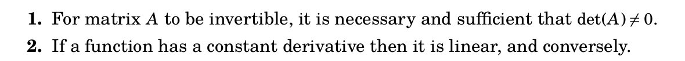
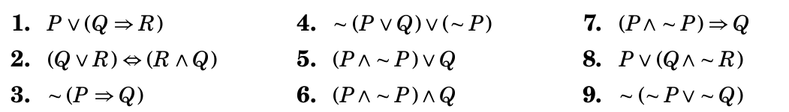
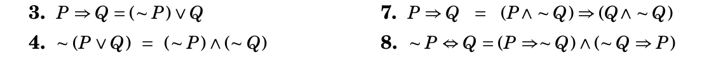

## Feb 1 Worksheet

Selected problems from Chapter 2 of *Book of Proof* by Hammack.

Write these statements in the form $P⟺Q$ for suitable statements $P$ and $Q$.

Write a truth table for the following logical statements.

Use truth tables to prove logical equivalence of these statements.

