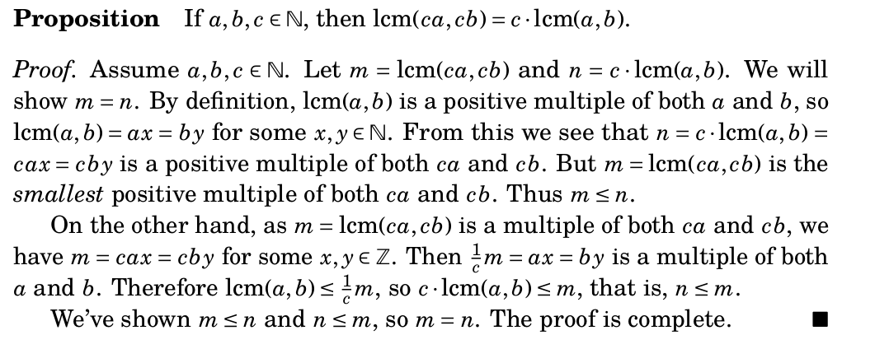

### Direct Proofs in-class Exercises

- Identify the hypothesis and the conclusion.
- Isolate any relevant definitions.
- Given an example illustrating the truth of the statement.
- Write a proof of the statement. 
- Verify that all hypotheses were used (or not). 

1. Suppose $x,y\in\mathbb{Z}$.  If $x$ and $y$ are odd, then $xy$ is odd.

2. Suppose $x,y\in\mathbb{Z}$.  If $x$ is even, then $xy$ is even.

3. If $x\in\mathbb{R}$ and $0<x<4$ then $\frac{4}{x(4-x)}\ge 1$.

4. If $a$ is an integer and $a^2|a$, then $a\in\{-1,0,1\}$

Analyze the following proof along the given lines.

