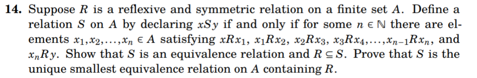

# Equivalence Relations

Key idea: An equivalence relation yields a partition of a set into disjoint subsets, and conversely.

1. Let $f$ and $g$ be polynomials with real coefficients.  Say that $fRg$ when they have the same derivative.
- Prove that this is an equivalence relation
- Describe the equivalence classes

2. Let $R$ and $S$ be equivalence relations on a set $A$.  Prove that $R\cap S$ is also an equivalence relation.
Suppose $R$ is the relation "congruent modulo $3$" and $S$ is the relation "congruent modulo $5$". What is the intersection of these two relations.

3. Prove or disprove: the union of two equivalence relations is an equivalence relation.

