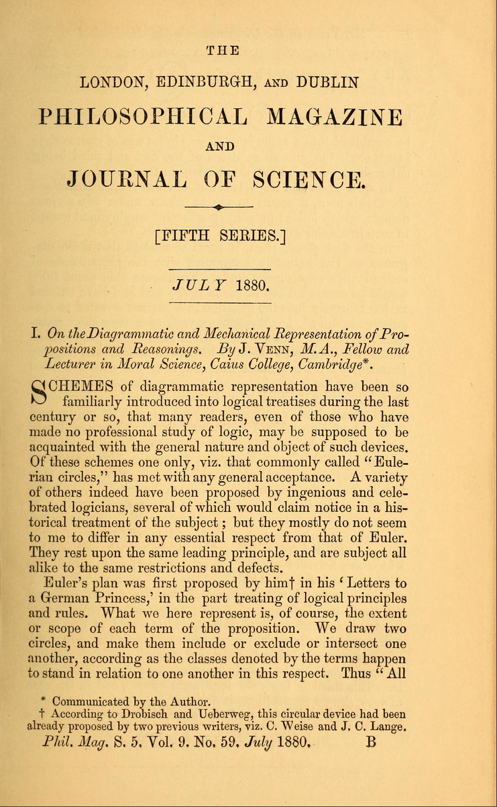
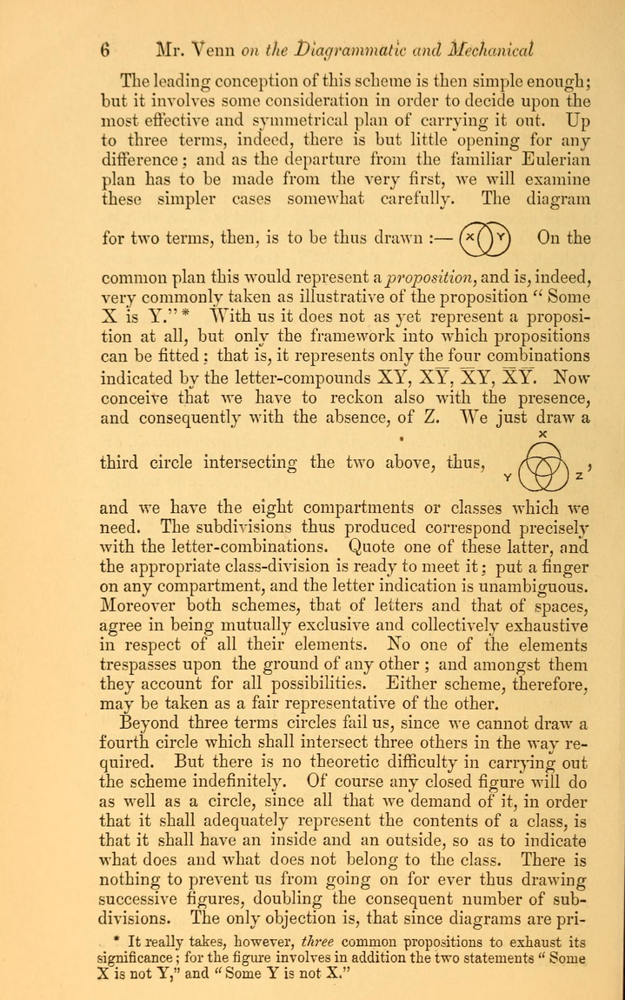
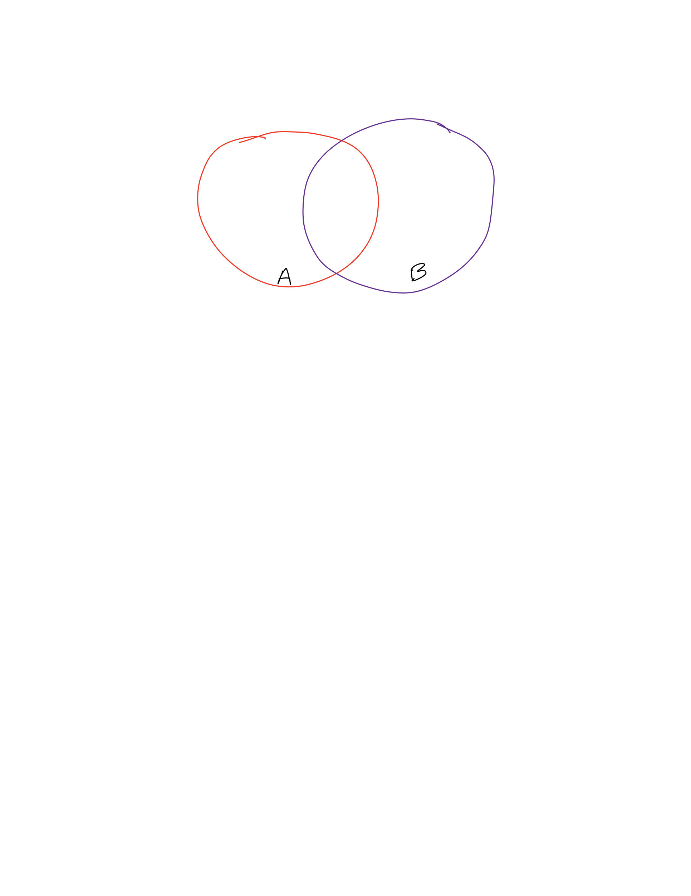

# Venn Diagrams

## What is a Venn Diagram?

> J. Venn M.A. (1880) I. On the diagrammatic and mechanical representation of propositions and reasonings, The London, Edinburgh, and Dublin Philosophical Magazine and Journal of Science, 10:59, 1-18, DOI: 10.1080/14786448008626877 

|   |   |   |
|---|---|---|
|{height=1.5in}|{height=1.5in}|{height=1.5in} |

## Venn Diagrams continued

- Graphical representation of set operations

- Convenient as check or for presentation and explanation  but (like any diagram) not conclusive without explanation.

## $A\cup(B\cap C)$ 

## $(A\cup B)\cap (A\cup C)$

## $(A-B)\cup C$

