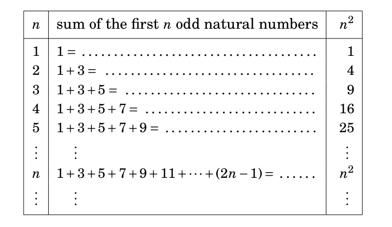

# Introduction to mathematical induction

## A sample problem

**Proposition:** The sum of the first $n$ odd natural numbers is $n^{2}$.

The first $n$ odd numbers are $1, 3, \ldots, 2n-1$.  So in summation notation this
is the claim that, for all $n\in\mathbb{N}$, 
$$
\sum_{i=1}^{n} (2i-1) = n^2
$$.

## Sample problem continued.

The proposition above is infinitely many statements.

## Sample continued

We can prove any *one* of these statements.
\vfill

How do we prove *all* of them?
\vfill

## Mathematical induction

Mathematical induction *extends* our system of logic by adding an axiom.  

**Axiom of Induction:** Let $P(n)$ be a collection of statements, one for each natural number.
Suppose that $P(1)$ is true and, for all $n$, the implication $P(n)\implies P(n+1)$ is true.
Then $P(n)$ is true for all $n$.

The book calls this a *method of proof* but it is really an axiom.

## A prototype

**Proposition:** Suppose that $S$ is a set such that $1\in S$ and, for all $n$, if $n\in S$, then 
also $n+1\in S$.  Then $\mathbb{N}\subseteq S$.

**Proof:** Let $P(n)$ be the statement $n\in S$.  The hypotheses say that $P(1)$ is true, and
that $P(n)\implies P(n+1)$.  Therefore $P(n)$ is true for all $n$, and so every natural number is in $S$,
so $\mathbb{N}\subset S$.

## Proof of the result on sum of odd numbers

**Proposition:** For all $n$, we have

$$
\sum_{i=1}^{n} (2n-1) = n^2.
$$

**Proof:** We apply mathematical induction.  The statement $P(n)$ is
$$
\sum_{i=1}^{n} (2n-1)=n^2.
$$
So $P(1)$ is the claim that $1=1^2$, which is true.  To prove that $P(n)\implies P(n+1)$, we assume
$P(n)$ true:

$$
1+3+5+\cdots+(2n-1)=n^2.
$$

## Proof, continued

\begin{multline*}
1+3+5+\cdots+(2n-1)+(2(n+1)-1)= \\ 1+3+5+\cdots+(2n-1)+2n+1= \\ n^2+2n+1=(n+1)^2.
\end{multline*}

Therefore, if $P(n)$ is true then $P(n+1)$ is also true.  By mathematical induction $P(n)$ is true for all $n$.

