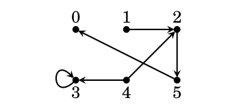

# Relations

\renewcommand{\subset}{\subseteq}

## Examples of Relations

- $=$, $<$, $>$, $\le$, $\ge$, $\not=$, *etc.* are relations between numbers. 

\vfill

- $\subseteq$ is a relation between sets

\vfill

- "is the parent of" or "is a child of" or "is a spouse of"  are relations between people.

\vfill

- "comes earlier in the dictionary" is a relation between words.

## Abstract Relations

Suppose we consider the relation  $<$ on $\mathbb{N}$.  We can "abstract" this relation by 
considering all pairs $(x,y)\in\mathbb{N}\times\mathbb{N}$ where $x<y$.   Let $R$ be the set of such pairs.

So $(1,2)\in R$, but $(5,4)\not\in R$.  

Once we have the set $R$, we know everything about $<$.  Namely
$$
x<y \Leftrightarrow (x,y)\in R.
$$

Now we *identify* the relation $<$ with this set $R$ and we can study relations using set theory.

## Pictures of relations

## A big picture

Here the underlying set is "North American Cities" and the relation is $(x,y)\in R$ if there was a United
flight joining the two cities in 2019.

{with=3in}

## Abstract Relations: formal definition

**Definition:**  Let $A$ be a set. A *relation* on $A$ is a subset $R$ of the Cartesian product $A\times A$.
We abbreviate the statement $(x,y)\in R$ as $xRy$, and $(x,y)\not\in R$ as $x\cancel{R}y$.

## Abstract relations: A few examples

- (Example 11.1) $A=\{1,2,3,4\}$ and  $R$ consists of
\small
$$
\{(1,1),(2,1),(2,2),(3,3),(3,2),(3,1),(4,4),(4,3),(4,2),(4,1)\}\subset A\times A
$$
\normalsize

- (Example 11.2) $A=\{1,2,3,4\}$ and $S$ consists of
$$
\{(1,1),(1,3),(3,1),(3,3),(2,2),(2,4),(4,2),(4,4)\}\subset A\times A
$$

## Abstract Relations

- (Example 11.3) The intersection of the two relations from the previous examples is a relation
$$
\{(1,1),(2,2),(3,3),(3,1),(4,4),(4,2)\}
$$

## One more example

- (Example 11.4) $B=\{0,1,2,3,4,5\}$ and 
$$
U=\{(1,3),(3,3),(5,2),(2,5),(4,2)\}\subset B\times B.
$$

## Problem 3, page 204.  

- Let $A=\{0,1,2,3,4,5\}$.  Write out the relation $R$ that expresses $\ge$ on $A$ and illustrate it with a diagram.

## Problem 5, page 204. 

Write out the sets $A$ and $R\subset A\times A$ described by this diagram.

{width=3in}
