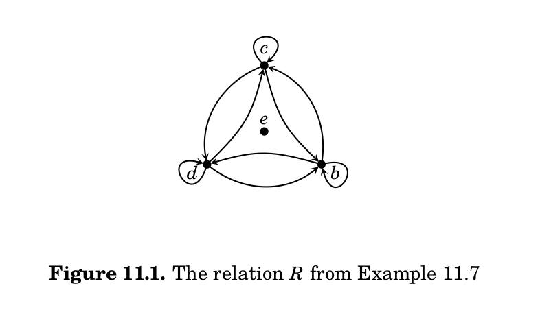

# Properties of Relations

## Reflexive Relations

**Definition:** A relation $R$ is **reflexive** if, for all $x\in A$, $(x,x)\in R$.  In other words, $xRx$ for
all $x\in A$. 

- The '=' relation is reflexive, as is the $\le$ relation.  

- The $<$ relation is not reflexive.

- The "is an ancestor of" relation is not reflexive.

- The $\not=$ relation is not reflexive.

## Symmetric Relations

**Definition:** A relation $R$ is **symmetric** if, for all $x,y\in A$, $xRy\implies yRx$.  In other words,
if $(x,y)\in R$ then $(y,x)\in R$.

- The '=' relation is symmetric

- The $\le$ relation is not symmetric

- The "is an ancestor of" relation is not symmetric.

- The $\not=$ relation is symmetric.

## Transitive relations

**Definition:** A relation $R$ is **transitive** if, for all $x,y,z\in A$, if $xRy$ and $yRz$ then $xRz$.
In other words, if $(x,y)\in R$ and $(y,z)$ in $R$ then $(x,z)\in R$.

- The '=' relation is transitive

- The $\le$ relation is transitive.

- The "is an ancestor of" relation is transitive.

- The $\not=$ relation is not transitive.

## Example 11.7

Examine the properties reflexivity, symmetry, and transitivity when $A=\{b,c,d,e\}$ and
$$R=\{(b,b),(b,c),(c,b),(c,c),(d,d),(d,b),(b,d), (c,d),(d,c)\}$$

## Example 11.7 continued

## A picture

{width=3in}

## Congruence is reflexive, symmetric, and transitive.

**Proposition:** Let $n\in\mathbb{N}$.  The relation $R$ on $\mathbb{Z}$ defined by $aRb$ if and only if $a\equiv b\pmod{n}$
is reflexive, symmetric, and transitive.

##

##

