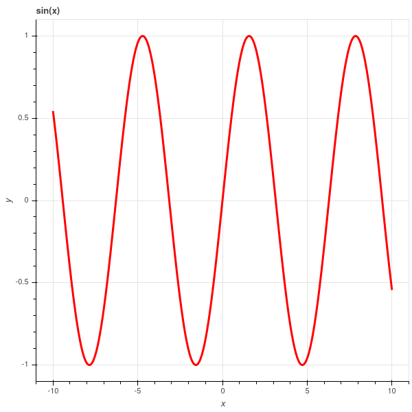
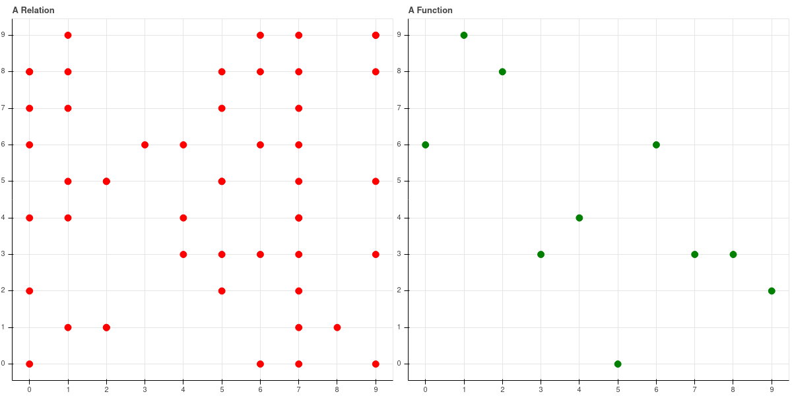
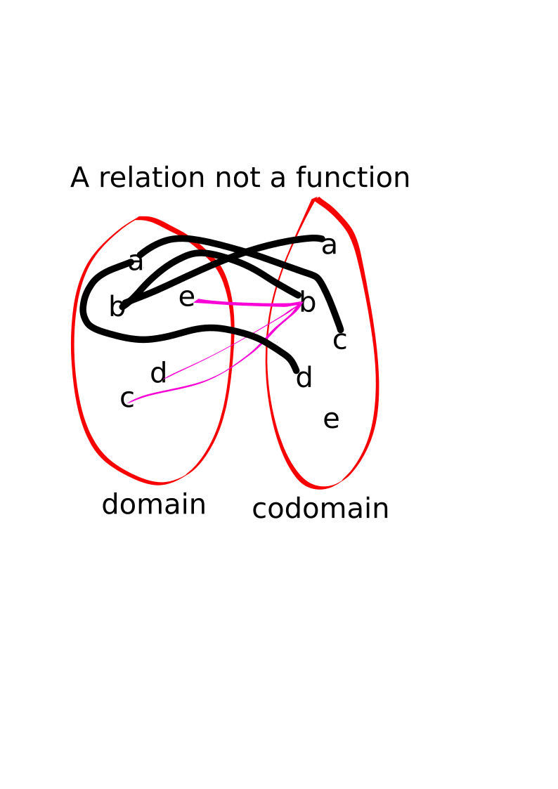
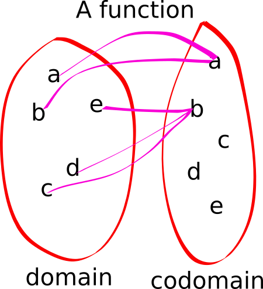

##  Functions via set theory

A typical "function" is given by a formula of the form
$$
f(x) = \sin(x)
$$
and we visualize it with its graph:

{width=2in}

## Functions as (special) relations

The key insight in abstracting the idea of "function" is to understand what the graph of a function
really is.

If $f:A\to B$ is a function, then the graph of $f$ is the set of points $G(f)=\{(a,b)\in A\times B: f(a)=b\}$.

Two observations:

1.  $G$ is a relation from the set $A$ to the set $B$ since $G\subset A\times B$.
2.  Everything we need to know about $f$ is stored in $G$.

$A$ is called the **domain** of $f$.  $B$ is called the **codomain** of $f$.

## Functions as (special) relations continued

The key property that makes a general relation a function is the fact that 

> for all $a\in A$, there exists a unique $b\in B$ so that the pair $(a,b)\in G(f)$. (note the quantifiers here).

Notice that for a general relation, there is no such condition -- *any* subset $R$ of $A\times B$
is a relation.  

## A general relation vs a function

{width=4in}

Drawn in this way, a relation $R\subset A\times B$ 
is a function if it passes the *vertical line test* - every vertical line hits exactly one point in $B$.

## relations vs functions continued

We can also explore the special properties of functions among relations using the other way of representing
functions.

{width=40%}
{width=25%}

## The range of a function

**Definition:** The range of a function $F$ is the set of $b\in B$ such that there exists $a\in A$ 
with $(a,b)\in F$.

In "old fashioned" terms, the range of $F$ is the set of $b$ for which there exists $a$ with $F(a)=b$. 

## Example of the range of a function

(Example 12.3 from the book).  We define $\phi:\mathbb{Z}\times\mathbb{Z}\to \mathbb{Z}$ by the formula
$\phi(m,n)=6m-9n$.  As a set, this is the function $\{(m,n),6m-9n\}$ as a subset of $\mathbb{Z}^2\times\mathbb{Z}$.

What is its range?

