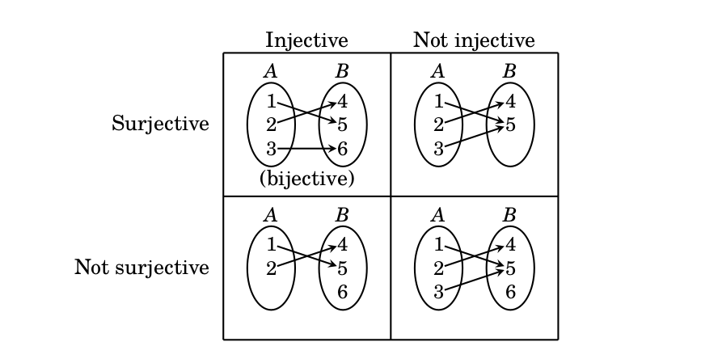

## Injective (1-1) and surjective (onto) functions

We introduce three fundamental properties that some functions have. These properties test your
ability to work with quantifiers in a very fundamental way.

## Injective functions

**Definition (12.4 in the book):** Let $f:A\to B$ be a function.  Then

- $f$ is called **injective** if, for all $a,a'$ in $A$,  if $a\not=a'$ then $f(a)\not=f(a')$. 
(Such $f$ are also called "one-to-one" functions).

## Surjective functions

- $f$ is called **surjective** if, for all $b\in B$, there exists $a\in A$ such that $f(a)=b$.
(such $f$ are also called "onto" functions.)

**Note:** whether a function is surjective depends on its codomain.  It is always surjective onto its
range. 

## Picture from page 229

## Bijective functions

- $f$ is called **bijective** if it is both surjective and injective.

