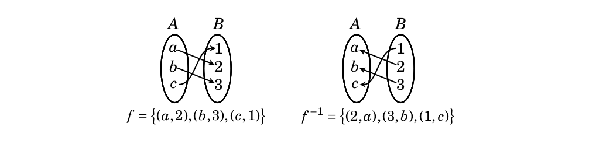
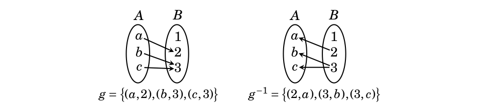

# Inverse functions

## Inverse functions

Let $A$ and $B$ be sets and let  $f\subset A\times B$ be a function ($f:A\to B$ in the alternative notation).
Since $f$ is a relation, one can consider the inverse relation $f^{-1}$.
\vfill
Sometimes the inverse relation $f^{-1}$ *is* a function, and sometimes it *is not* a function.
\vfill\eject

## Examples

Let $R$ be the relation $\{(x,x^2):x\in\mathbb{R}\}\subset\mathbb{R}\times\mathbb{R}$.
\vfill
- $R$ is a function because for every $x\in\mathbb{R}$ there is a unique $y=x^2$ in $\mathbb{R}$ so that
$(x,y)\in R$.

\vfill
- $R^{-1}$ is *not* a function because both $(1,-1)$ and $(1,1)$ are in $R^{-1}$.  

\vfill\eject

## Example

Let $R$ be the relation $\{(x,\frac{1}{1+x^2}):x\in\mathbb{R}\}\subset\mathbb{R}\times\mathbb{R}$.  

- $R$ is a function.
\vfill

- $R^{-1}$ is *not* a function because $0<\frac{1}{1+x^2}\le 1$ for all $x$, and therefore there is
no pair $(x,y)\in R^{-1}$ with $x=2$.

\vfill\eject

## Examples

Let $R$ be the relation $\{(x,x^3):x\in\mathbb{R}\}\subset\mathbb{R}\times\mathbb{R}$.

- $R$ is a function because for every $x\in\mathbb{R}$ there is a unique $y=x^3$ in $\mathbb{R}$ so that
$(x,y)\in R$.

\vfill

- $R^{-1}$ is also a function because for every $x\in\mathbb{R}$
there is a unique $y=x^{1/3}$ for every $x\in\mathbb{R}$
so that $(x,y)\in R^{-1}$.

\vfill\eject

## Examples (p. 239)

\vfill

\vfill\eject
## The Inverse Function Theorem

**Theorem:** Let $F\subset A\times B$ be a function.  The inverse relation $F^{-1}\subset B\times A$ is also a function
if and only if $F$ is bijective.

<!--
**Proof:** First suppose that $F$ is bijective.  We must show that, if $x\in B$, there is a unique $y\in A$
such that $(x,y)\in F^{-1}$.  In other words, we must show that there is a unique $y\in A$ such that
$(y,x)\in F$.   Since $F$ is surjective, there is at least one $y\in A$ such that $F(y)=x$, so that
there is at least one $y\in A$ with $(y,x)\in F^{-1}$.  Suppose that $y$ and $y'$ in $A$ have the property
that $F(y)=F(y')=x$.  Then, since $F$ is injective, we have $y=y'$.  Thus there is a unique $y\in A$
such that $(x,y)\in F^{-1}$ and so $F^{-1}$ is a function.
-->

<!--
**Proof: cont'd** Now suppose that $F^{-1}$ is a function.  This means that, for every $x\in B$, there
is a unique $y\in A$ so that $(x,y)\in F^{-1}$ and $(y,x)\in F$.  Since, for every $x\in B$, there
is at least one $y\in A$ so that $(y,x)\in F$, we see that $F$ is surjective.  Suppose that $F(y)=F(y')$
for $y,y'\in A$.  Then $(y,x)\in F$ and $(y',x)\in F$ and therefore $(x,y)$ and $(x,y')$ are in $F^{-1}$.
Since $F^{-1}$ is a function, we must have $y=y'$.  Therefore $F$ is injective and therefore bijective.
-->
\vfill\eject
## Inverse functions (definition)

**Definition:** If $f:A\to B$ is bijective, then its **inverse** is the function 
$$f^{-1}:B\to A.$$
We have 
$$
f^{-1}\circ f:A\to A = i_A.
$$
and
$$
f\circ f^{-1}:B\to B = i_B
$$

