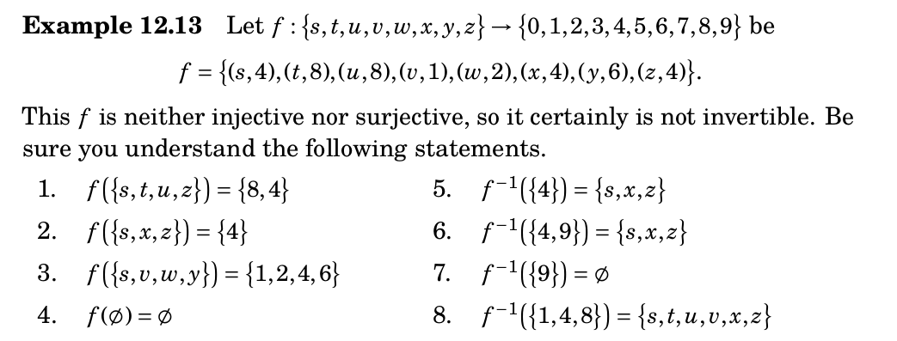

# Image and preimage

\renewcommand{\subset}{\subseteq}

## Key defintions

**Definition:** Let $f:A\to B$ be a function.

1. If $X\subseteq A$, then the **image** of $X$ is the set $f(X)=\{f(x):x\in X\}\subseteq B$.
2. If $Y\subseteq B$, then the **preimage** of $Y$ is the set $f^{-1}(Y)=\{x\in A: f(x)\in Y\}\subseteq A$.

**Note:** $f^{-1}(Y)$ is defined *even when* $f^{-1}$ is not a function, i.e. even when $f$ is not bijective.

## Example 12.13

## Problem 12.6.7

**Problem:** Prove that, if $f:A\to B$ is a function, and $W$ and $X$ are subsets of $A$, then
$$f(W\cap X)\subset f(W)\cap f(X)$$

## Problem 12.6.9

**Problem:** Prove that, if $f:A\to B$ is a function, and $W$ and $X$ are subsets of $A$ then
$$f(W\cup X) = f(W)\cup f(X)$$

