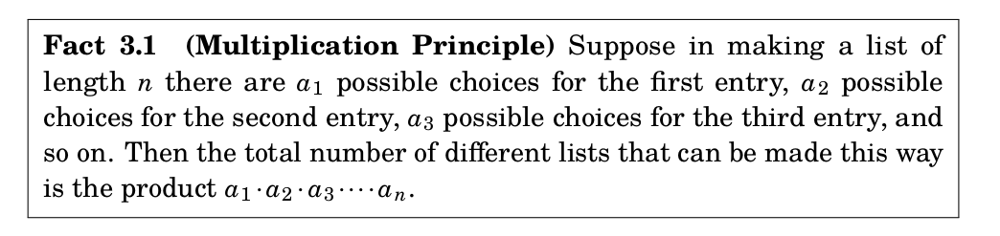

# Counting

## Lists

**Definition:** a (finite) list is an element of the Cartesian product of sets $X=X_1\times\cdots X_n$.
A common counting problem is to determine the number of lists  with certain properties whose entries
are drawn from a Cartesian product like $X$.

## Multiplication Principle

This informal principle can be applied in many settings, although in most cases there is a *hidden*
proof by induction.

## Example

**Proposition:** Suppose that $X_1,\ldots,X_n$ are finite sets.  Then
$$
|X_{1}\times\cdots\times X_{n}|=|X_{1}||X_{2}|\cdots |X_{n}|.
$$
\vfill\eject

## Example

How many ways can you order a coffee if your choices are whole, skim, or soy milk; small, medium, or large size;
and one or two shots of espresso?

\vfill\eject
## Example

Consider lists of length $4$ made with the symbols $A,B,C,D,E,F,G$.

**Question:** How many lists are there made up of these symbols (no special conditions)

\vfill\eject
## Example continued

**Question:** How many lists are there if no letter is repeated?

\vfill\eject
## Example continued

**Question:** How many lists are there if there are no repetitions, and at least one of the letters is an $E$?

\vfill\eject
## Example continued

**Question:** How many lists are there if repetition *is* allowed, and the list contains at least one $E$?
