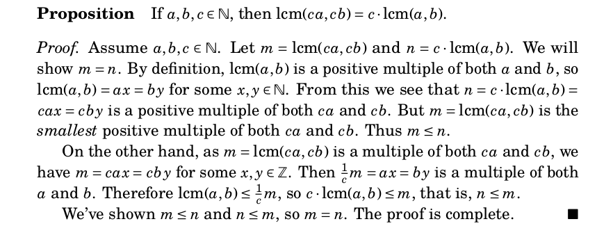

# Direct Proof
\newcommand{\lcm}{\mathrm{lcm}}

## From page 122 of the text

## The hidden part - check the definitions

**Definition:** Let $a$ and $b$ be positive integers.  Then the least common multiple $\mathrm{lcm}(a,b)$
is the smallest positive integer $m$ such that $a|m$ and $b|m$.

## The hidden part II

Second, make sure the claim is clear. Look at some examples.

## The hidden part continued III - interpret the definition

Three ways of saying the same thing:

- $x$ is the smallest positive integer such that $a|m$ and $b|m$ 

- If $x$ is a positive integer so that $a|x$ and $b|x$, then $x\ge\lcm(a,b)$.

- If $x$ is a positive integer so that $a|x$ and $b|x$, then $\lcm(a,b)\le x$.

## The hidden part IV

Read the proof to understand it's structure, without worrying about the details.

## Take the proof of the proposition apart

- Assume $a,b,c\in\mathbb{N}$.

- Let $m=\lcm(ca,cb)$ and $n=c\lcm(a,b)$.  We will show that $m=n$.

- By definition, $\lcm(a,b)$ is a positive multiple of both $a$ and $b$, so $\lcm(a,b)=ax=by$ for
some $x$ and $y$ in $\mathbb{N}$.

- From this we see that $n=c\lcm(a,b)=cax=cby$ is a positive multiple of both $ca$ and $cb$.  Thus
$m\le n$.

## Taking the proof apart

- On the other hand, as $m=\lcm(ca,cb)$ is a multiple of both $ca$ and $cb$, we have $m=cax=cby$ for some
$x,y\in\mathbb{Z}$.

- Then $\frac{1}{c}m=ax=by$ is a multiple of both $a$ and $b$.

- Therefore $\lcm(a,b)\le\frac{1}{c}m$ so $c\lcm(a,b)\le m$, that is $n\le m$.

- Since $m\le n$ and $n\le m$, we have $m=n$.  The proof is complete.

