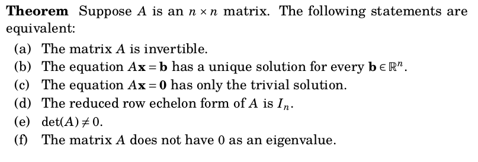

# If and only if

## If and only if statements

A theorem that asserts that two statements $P$ and $Q$ are equivalent requires you to prove *both*
$P\implies Q$ and $Q\implies P$.

## Chapter 7 exercise 3.

**Proposition:** If $a$ is an integer, then $a$ is even if and only if $a^3+a^2+a$ is even.

There are two claims:

$a$ even implies $a^3+a^2+a$ is even.

$a^3+a^2+a$ is even implies $a$ is even.

Each requires proof.

##

**Proof:** First we show that, if $a$ is even, then $a^3+a^2+a$ is even. 

##

Now we show that, if $a^3+a^2+a$ is even, then $a$ is even.

## Chapter 7, exercise 9.

**Proposition:** Suppose that $a$ is an integer.  Then $14|a$ if and only if $7|a$ and $2|a$.

##

**Proof:** First we suppose that $14|a$ and show that both $7$ and $2$ divide $a$.

##

Now we show that, if both $7$ and $2$ divide $a$, then $14$ divides $a$.

## Equivalence

## Cycle proofs

If each step in the circle of implications:

$$P_1\implies P_2\implies P_3\implies\cdots\implies P_{n}\implies P_1$$

is true, then all of the statements are equivalent -- that is, all true or all false together.

