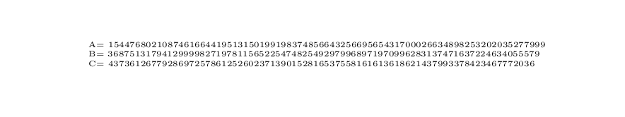

# Existence Proofs

## Review of universal quantifiers

A theorem asserting the truth of a conditional statement is typically a "for all" statement.

**Theorem:** If a function $f:\mathbb{R}\to\mathbb{R}$ is differentiable, it is continuous.

Here there is an implicit *universal quantifier.*

**Theorem:** For all functions $f:\mathbb{R}\to\mathbb{R}$, $f$ differentiable implies $f$ continuous.

## Another example

**Theorem:** An $n\times n$ matrix $A$ with real entries is invertible if and only if $\mathop{det}(A)\not=0$.

This is asserting that:

For all $n\times n$ matrices $A$ with real entries, $A$ is invertible if and only if $\mathop{det}(A)\not=0$.

## Existence claims

Some theorems assert the existence of an object with particular properties. 

Proof of an existence theorem generally requires you to present an example.

**Definition:** A Pythagorean Triple is an element $(a,b,c)$ of $\mathbb{N}^3$ such that
$$
c^2=a^2+b^2.
$$

**Theorem:** A Pythagorean triple exists.

**Proof:** Let $a=3$, $b=4$, and $c=5$.  Then $c^2=25=a^2+b^2$.

## Existence claims can be hard to establish

**Theorem:** There exist natural numbers $A$, $B$, and $C$ so that

$$
A/(B+C)+B/(A+C)+C/(A+B)=4.
$$

##

**Proof:**  Let

Then these values satisfy the given equation.  (Check this if you can!)

- verification requires work
- no clue given as to how to find this; and, in fact, it's hard.

## Millenium Problems: Navier-Stokes

One of the million dollar millenium problems is an existence claim about solutions to 
the Navier Stokes equation for fluid flow. 
