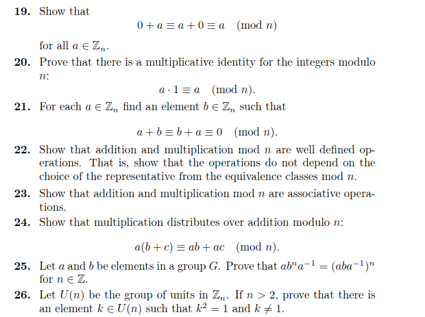
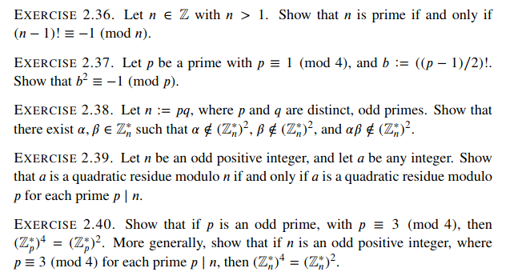
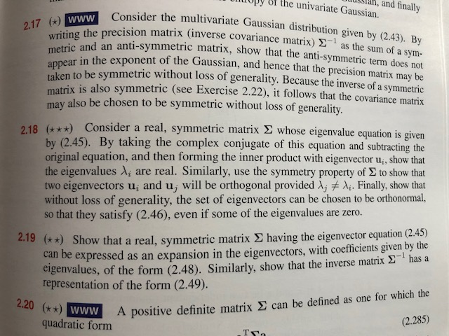

### Algebra Example

 

from  [Abstract Algebra: Theory and Applications](http://abstract.ups.edu/download/aata-20190710-print.pdf) by Judson.

### Analysis Example

 

from [Intro to Real Analysis](http://ramanujan.math.trinity.edu/wtrench/texts/TRENCH_REAL_ANALYSIS.PDF) by Trench.

### Number Theory Example

from [A Computational Introduction To Number Theory and Algebra (v2)](https://shoup.net/ntb/ntb-v2.pdf) by Shoup.

### Machine Learning Example

from [Pattern Recognition and Machine Learning](https://www.microsoft.com/en-us/research/uploads/prod/2006/01/Bishop-Pattern-Recognition-and-Machine-Learning-2006.pdf) by Bishop
