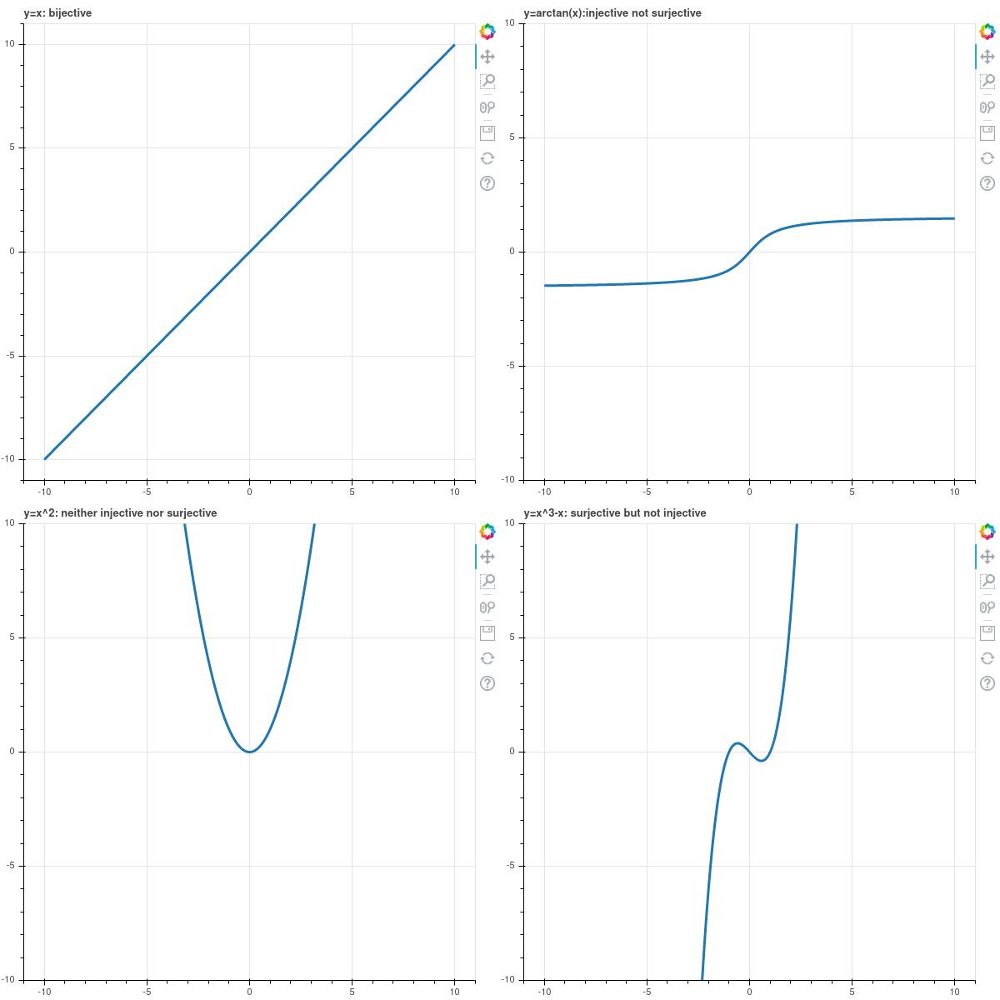

# Relations

**Definition:** Let $A$ and $B$ be sets.  A relation on $A$ and $B$ is a subset $R$ of the cartesian
product $A\times B$.  If $(a,b)\in R$ we write $aRb$.  If $A=B$, we talk about "a relation on $A$"
as shorthand for a relation on $A$ and $A$.  

**Definition:** If $A$ is a set and $R$ is a relation on $A$, then $R$ is *reflexive* if, for all $a\in A$,
$(a,a)\in R$.  In other words, $aRa$ for all $a\in A$. 

**Definition:** If $A$ is a set and $R$ is a relation on $A$, then $R$ is symmetric if for all $a,b\in A$,
$(a,b)\in R\implies (b,a)\in R$.  In other words, for all $a\in A$, $aRb\implies bRa$.

**Definition:** If $A$ is a set and $R$ is a relation on $A$, then $R$ is transitive if, for all
$a,b,c\in A$, if $(a,b)\in R$ and $(b,c)\in R$ then $(a,c)\in R$.  In other words, if $aRb$ and $bRc$ then
$aRc$.

**Definition:** A relation $R$ on a set $A$ is called an *equivalence relation* if $R$ is 
reflexive, symmetric, and transitive.

**Definition:** Suppose that $A$ is a set and $R$ is an equivalence relation on $A$.  Then, for any
$a\in A$, the *equivalence class* of $a$ under $R$ is the set $[a] = \{b\in A: (a,b)\in R\}$.

**Definition:** A *partition* of a set $A$ is a set $U$ of non-empty subsets of $A$ such that the
intersection of any two different elements of $U$ is empty, and the union of all elements of $U$ is $A$.

**Theorem:** Suppose $R$ is an equivalence relation on a set $A$.  Then the set of equivalence
classes under $R$ form a partition of $A$.

\vfill\eject

# Functions

**Definition:** Let $A$ and $B$ be sets.  A function $f:A\to B$ is a relation on $f\subset A\times B$
with the property that, for all $a\in A$, there exists a unique $b\in B$ such that $(a,b)\in f$.
If $(a,b)\in f$, we write $b=f(a)$.  The set $A$ is called the *domain* of $f$.  The set $B$
is called the *codomain* of $f$.

**Definition:** Let $f:A\to B$ be a function.  The *range* of $f$ is the subset 
$$\mathrm{range}(f)=\{b\in B: \exists a\in A, f(a)=b\}$$

**Definition:** Let $f:A\to B$ and $g:C\to D$ be two functions.  Then $f$ and $g$ are
equal if they are equal as sets $f\subset A\times B$ and $g\subset C\times D$.  

**Proposition:** If two functions are equal, they have the same domain and range (but not necessarily
the same codomain).  

**Definition:** Let $f:A\to B$ be a function.  $f$ is *injective* if, for all $a,a'\in A$,
if $a\not=a'$ then $f(a)\not=f(a')$.  Equivalently (by the contrapositive), $f$ is injective
if for all $a,a'\in A$, if $f(a)=f(a')$, then $a=a'$. 

**Definition:** Let $f:A\to B$ be a function.  $f$ is *surjective* if, for all $b\in B$, there exists
$a\in A$ such that $f(a)=b$.  Equivalently, a function is surjective if its codomain equals its range.

**Definition:** Let $f:A\to B$ be a function.  If $f$ is both surjective and injective, then it is called
*bijective.*

\vfill\eject

## Examples

{width=100%}

\vfill

